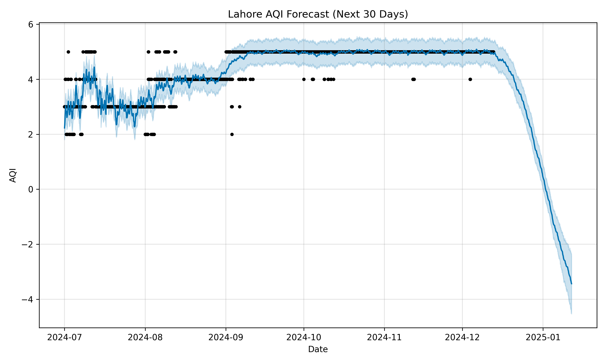
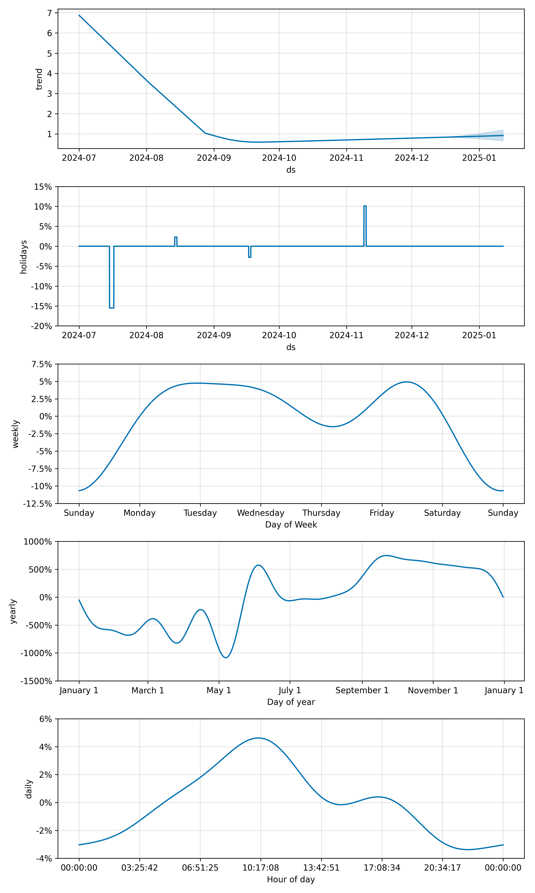

# Pakistan AQI Forecaster – Lahore  

**Live Interactive Dashboard**  
[](https://muneebtalks-air-quality-pakistan.streamlit.app)

**Real-time Air Quality Forecasting using Facebook Prophet + Pakistan Holidays**  
Trained on 6 months of real hourly data (July–Dec 2024)  

  


---

### Live Demo  
https://air-quality-pakistan.streamlit.app/
### Key Features  
- 1–60 day interactive AQI forecast with confidence intervals  
- Automatically detects **Eid, Independence Day & winter smog peaks** (Pakistan holidays included)  
- Fully interactive Plotly charts  
- Seasonality breakdown (daily, weekly, yearly + holidays)  
- One-click CSV forecast download  
- 100% open-source & reproducible  

### Tech Stack  


### Data Source  
[Pakistan Air Quality Pollutant Concentrations (2018–2024)](https://www.kaggle.com/datasets/hajramohsin/pakistan-air-quality-pollutant-concentrations)  
by Hajra Mohsin – Kaggle  

### Repository  
https://github.com/muneebtalks/air-quality-pakistan  


### Run Locally  
```bash
git clone https://github.com/muneebtalks/air-quality-pakistan.git
cd air-quality-pakistan
python -m venv .venv
.\.venv\Scripts\activate   # Windows
# source .venv/bin/activate # macOS/Linux
pip install -r requirements.txt
streamlit run app.py
```